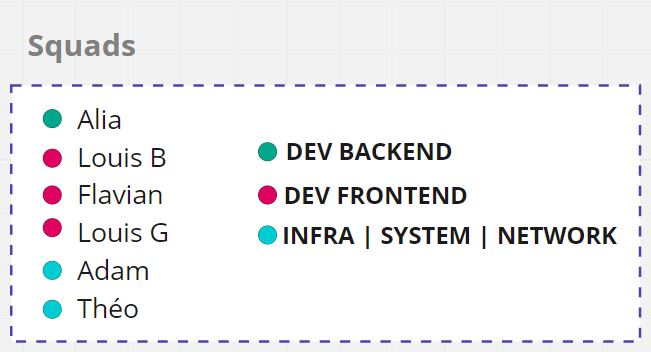
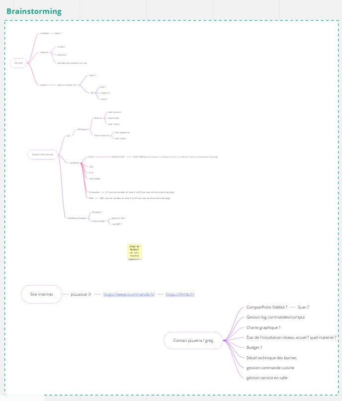
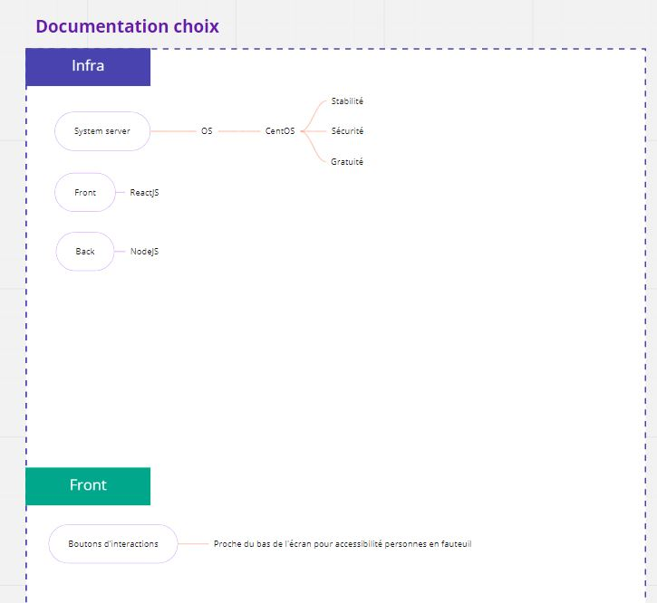
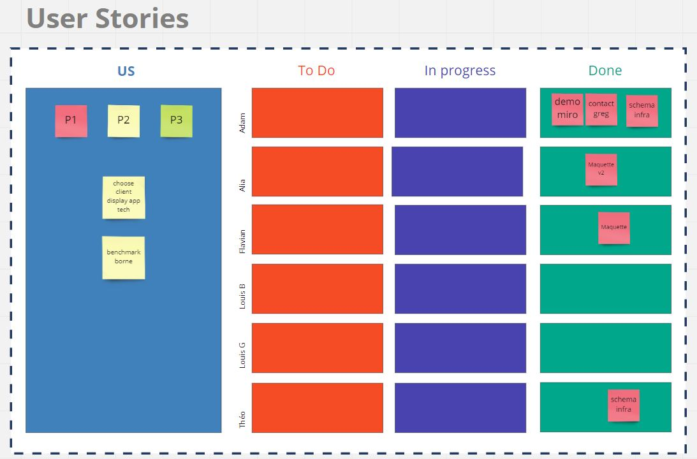
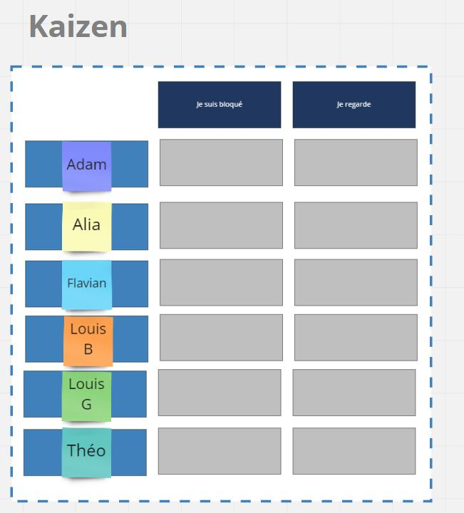

# Miro
Lien: https://miro.com/app/board/o9J_lfhSWDI=/

## Description

Miro est un whiteboard en ligne permettant de faire de la collaboration visuelle, ce dernier a été utilisé afin de créer notre management visuel.

Ce concept, apporté par la culture du "Lean Management" est axé sur la perception visuelle et a pour objectif de rendre l’information plus concrète, visible, perceptible, de façon à permettre implicitement une prise de décision plus rapide et efficace.

Autre avantage non négligable, cette organisation permet la collaboration à distance asynchrone, où les modules peuvent être complétés à tour de roles (si l'utilisation du module est prévue pour cela).

## Differents modules
Nous y avons designé les modules suivants:

### Definitions des squads

Découpe de notre équipe en differents pôles afin de definir à l'avance qui fait quoi dans l'équipe.

### Brainstorming

Zone de tableau blanc permettant de travailler ensemble afin de mettre à plat et comparer les differentes idées ou alternatives de solution répondant à nos differents besoins.

### Documentation choix

Permet d'ancrer les choix et de garder une trace des decisions prises.

### Users Stories

Kanban, où est effectuée la découpe et mise en backlog les taches techniques. Puis elles sont prises par les differentes personnes de l'équipe.

### Kaizen

Permet de signaler un bloquage afin d'être accompagné par une autre personne.

# Moyens financiers & humains

## Materiel

+ Box 4G : 50€
+ Serveur Rack PowerEdge R240: 1025€
+ Firewall pfsense NETFATE 2100 BASE PFSENSE+ : 300€
+ Switch Cisco SG250-08 : 105€
+ Onduleur EATON 5P1150IR: 525€

## Licence

GITHUB : 21$ par utilisateur / mois
vSphere Essentials: 500€

## Humain

Pour mener à bien le projet, l’idéal serait d’avoir :

+	2 développeurs Front-end
+	2 développeurs Back-end
+	1 architecte système
+	1 architecte réseau
+	1 équipe réalisant des audits de cybersecurité

En moyenne, nous avons calculé :
+	350€ / jour pour un Freelance ou un développeur junior
+	500€ / jour pour un développeur avec expérience
+	700€ / jour pour un chef de projet expérimenté ou un spécialiste
+	600€ / jour pour un architecte système/réseau
+	5000€ par audit de sécurité (5J)

Nous avons pensé à un délai de :
+ 20 jours pour la partie système / réseau qui comprend le design de l'infra, sa configuration et son installation.
+	3 mois pour la partie développement qui comprend la réflexion de l’architecture des services, du code, de des reviews de code et du testing.
+	Les audits de sécurité auraient lieu à 2 reprises, une en fin de projet afin de realiser un etat des lieux, puis un deuxieme pour attester de la bonne résolutions des problemes par l'équipe.

Avec nos calculs on serait sur un total de 70 jours.

Si nous avons une équipe mixte composée de juniors & seniors:
+	DEV : ((2 x 500)+(2 x 350)) x 60  = 102 000
+	ARCHI : (2 x 600) x 20 = 24 000
+	SEC : 2 x 5000 = 10 000
+ CDP : 700 * 60 = 42 000

## Total
+ Total Humain: 178 000 €
+ Total Materiel & logiciel: 4900€
+ Total Projet: 182 900€
# Gestion de projet :

Nous avons besoin de déterminer les indicateurs de pilotage nécessaires, c’est à dire :

•	Indicateur de résultat : permettant de prévenir de toute dérive constatée par rapport aux prévisions : 
+ Chiffre d’affaires moyen de la pizzeria
+ Nombre de ventes
+ Nombre de visite d’un même client
+ Largeur de la gamme (menu)

•	Indicateur d’activité : permet d’apporter un éclairage qualitatif sur les carences éventuelles à corriger :
+ Nombre de nouveaux clients appartenant à une cible (ici on peut prendre la cible des jeunes étudiants)
+ Chiffre d’affaires dégagé sur la cible
+ Taux de transformation